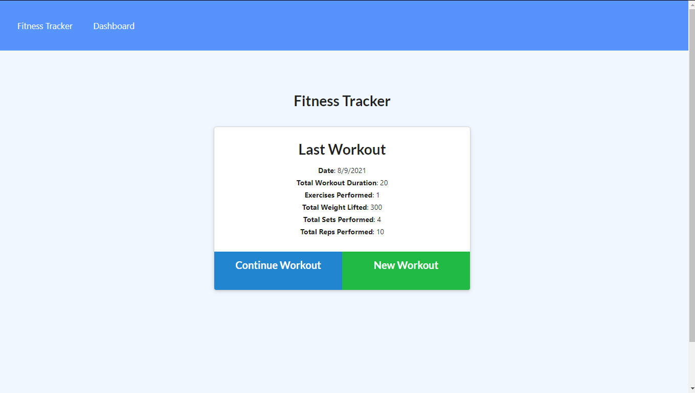
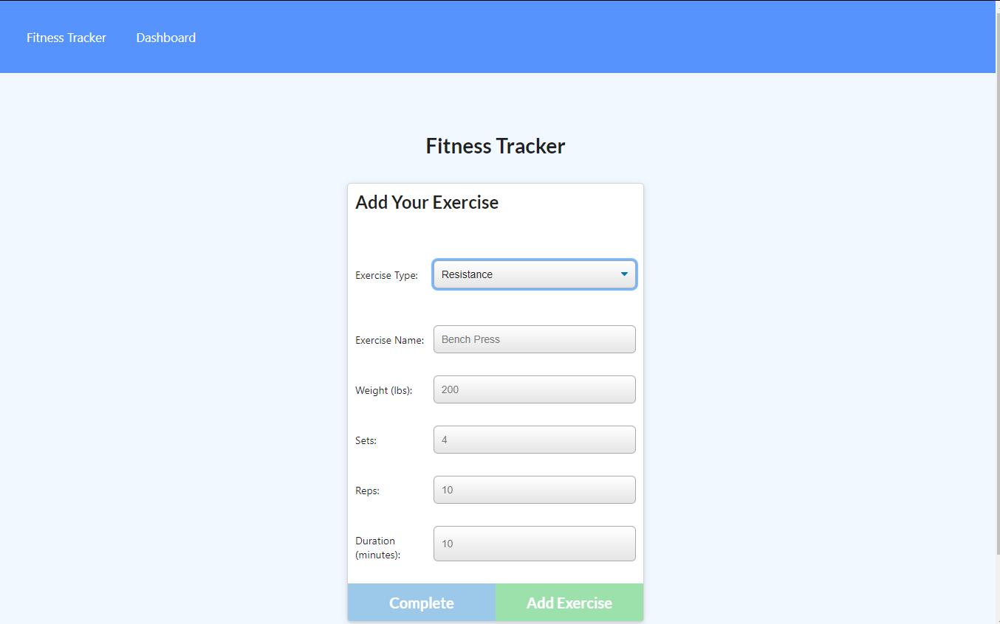
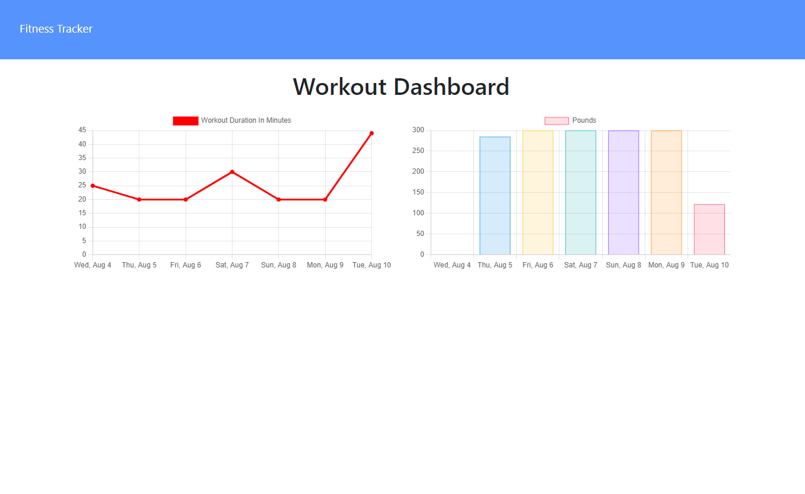

# WorkoutTracker
[](https://opensource.org/licenses/MIT) 
## Description: 
This is an application that you can use to keep track of the workouts you have completed.  You can enter multiple exercises for each workout, and the app will store each exercise type (cardio or resistance), the duration of the exercise, the distance, the weight, along with number of sets and reps.  This application uses Node.js, an Express server, and Mongoose. You can install and run on a local server, or use the deployed version.     
## Table of Contents: 
* [Installation](#installation)
* [Usage](#usage) 
* [License](#license) 
* [Contributing](#contributing) 
* [Questions](#questions) 
## Installation: 
[Click here for deployed app](https://technologyblog.herokuapp.com/)   
   
Or to run locally:

* You will need to have Node.js and MongoDB installed. 
* AFter cloning the repo, run ```npm install``` in your bash terminal to install the dependencies.
* Be sure to log into mongod. 
* Run ```npm start``` to initialize the server on your local machine, then once you get the message "App is listening on PORT: 3000", go to localhost:3000 in your browser. 


 
## Usage: 
The homepage will display details of your last workout.  To create a new workout click on "New Workout" where you will be prompted to choose the exercise type and then enter relevent information for that exercise.   When all information for that exercise is entered, click "Add Exercise" to store the information for that exercise.  From there you can enter information for another exercise for that workout, or click "Fitness Tracker" in the navbar to return to the homepage.  To add another exercise to your current workout click "Continue Workout" or to start a new workout click "New Workout".  If you click the dashboard in the navbar you will see a graph with the previous seven workouts including the workout duration and the total pounds used per workout. 








## License: 
Licensed under the [MIT](https://opensource.org/licenses/MIT) license. 
## Contributing: 
Feel free to contact me to contribute to this project. My contact information is listed below.

## Questions: 
GitHub: [melinamboedecker](https://github.com/melinamboedecker) 

If you have any additional questions, please contact me at melinamboedecker@gmail.com. 
